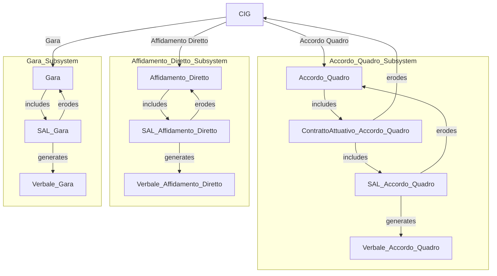

# Task Manager

Il progetto **Task Manager** è un'applicazione web destinata alla gestione e monitoraggio di contratti e interventi per servizi vari. Utilizza una struttura modulare per tenere traccia delle aziende, dei contratti, dei SAL (Stati Avanzamento Lavori), dei verbali e dei tecnici coinvolti. Il sistema è progettato per gestire diverse tipologie di servizi e contratti, e per facilitare la pianificazione e il controllo degli interventi.

## Indice

- [Panoramica](#panoramica)
- [Tecnologie Utilizzate](#tecnologie-utilizzate)
- [Struttura programma](#struttura-programma)

## Panoramica

Il Task Manager ti permette di:

- Creare, visualizzare, aggiornare e cancellare task.
- Gestire i task in diverse categorie o progetti.
- Utilizzare l'autenticazione tramite Firebase per gestire gli utenti e mantenere i dati sicuri.

## Tecnologie Utilizzate

- **React**: Framework per la creazione dell'interfaccia utente.
- **Firebase**: Per autenticazione, database e hosting.
- **React Router**: Per la navigazione tra le pagine dell'applicazione.
- **CSS/SCSS**: Per la progettazione e lo styling dell'interfaccia utente.

## Struttura Programma

