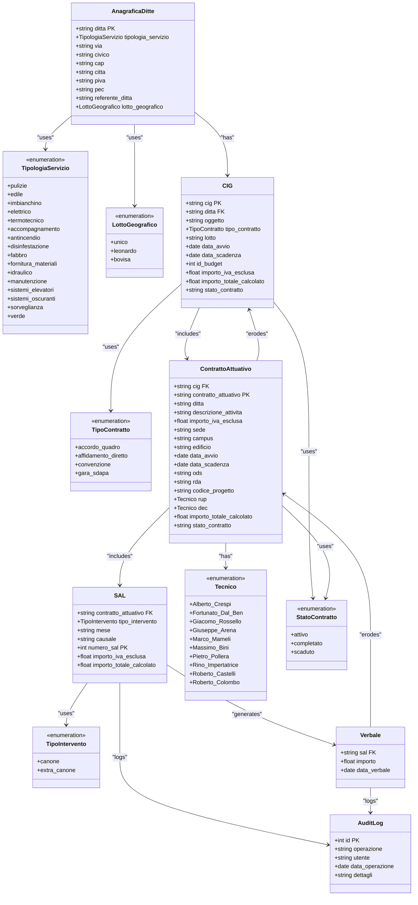

### Note:

- **Sintassi di Mermaid**: Questo formato è progettato per essere utilizzato con strumenti che supportano Mermaid per la visualizzazione dei diagrammi. Mermaid è un linguaggio di markup per generare diagrammi e grafici.
- **Componenti del Diagramma**: Ogni classe è definita con le sue proprietà e tipi di enumerazione. Le relazioni tra le classi sono indicate con frecce che rappresentano le associazioni o le dipendenze tra di esse.
- **Uso di `<<enumeration>>`**: Le enumerazioni sono indicate con `<<enumeration>>`, che è una convenzione di Mermaid per le classi che rappresentano un insieme limitato di valori.

Puoi copiare e incollare questo codice in un editor che supporta Mermaid per visualizzare il diagramma delle classi.

